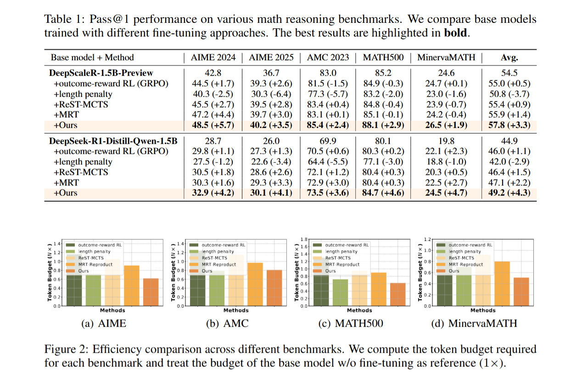

# L2T: Learning To Think
[](https://awesome.re) 


This repository contains the pytorch code for the 2025 NeurIPS paper "[Learning to Think: Information-Theoretic Reinforcement Fine-Tuning for LLMs](https://wangjingyao07.github.io/L2T.github.io/)"

# Introduction
Large language models (LLMs) excel at complex tasks thanks to advances in their reasoning abilities. However, existing methods overlook the trade-off between reasoning effectiveness and efficiency, often encouraging unnecessarily long reasoning chains and wasting tokens. To address this, we propose Learning to Think (L2T), an information-theoretic reinforcement fine-tuning framework for LLMs to make the models achieve optimal reasoning with fewer tokens. Specifically, L2T treats each query-response interaction as a hierarchical session of multiple episodes and proposes a universal dense process reward, i.e., quantifies the episode-wise information gain in parameters, requiring no extra annotations or task-specific evaluators. We propose a method to quickly estimate this reward based on PAC-Bayes bounds and the Fisher information matrix. Theoretical analyses show that it significantly reduces computational complexity with high estimation accuracy. By immediately rewarding each episode's contribution and penalizing excessive updates, L2T optimizes the model via reinforcement learning to maximize the use of each episode and achieve effective updates. Empirical results on various reasoning benchmarks and base models demonstrate the advantage of L2T across different tasks, boosting both reasoning effectiveness and efficiency.

# Get Started

## Environment
Our code is implemented based on the [Verl](https://github.com/volcengine/verl?tab=readme-ov-file). We recommend using the same Docker image / environment as Verl.

## Data
The data format and directory layout follow Verl’s conventions. In our scripts we assume paths such as:

```text
/root/data/gsm8k/train.parquet
/root/data/gsm8k/test.parquet
```

You can modify these paths directly in `run_rm.sh` and `run_L2T.sh` to point to your own datasets.


## Train
The full pipeline consists of **two stages**:

1. Train/prepare the reward model (RM)
2. Run L2T (policy training) with Verl

All key parameters (model path, data path, batch size, GPUs, etc.) are configured inside the `.sh` scripts. Running:

```bash
bash run_rm.sh
# After the reward model is ready, start L2T training in a new terminal:
bash run_L2T.sh
```


# Main Results


# Citation
If you find our work and codes useful, please consider citing our paper and star our repository (🥰🎉Thanks!!!):
```
@article{wang2025learning,
  title={Learning to think: Information-theoretic reinforcement fine-tuning for llms},
  author={Wang, Jingyao and Qiang, Wenwen and Song, Zeen and Zheng, Changwen and Xiong, Hui},
  journal={arXiv preprint arXiv:2505.10425},
  year={2025}
}
```